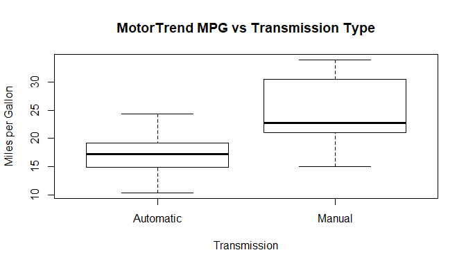
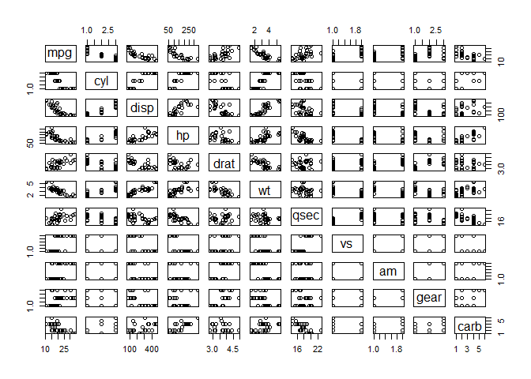
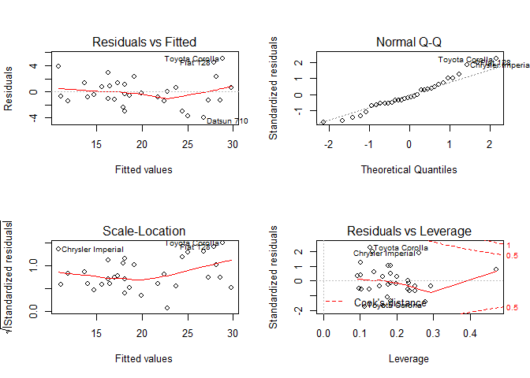

# Analysis - Motor Trend
Jacob Schwartz  
November 10, 2017  


## Executive Summary

For this analysis, we work for Motor Trend, a magazine about the automobile industry. Looking at a data set of a collection of cars (the `mtcars` dataset in R), we are interested in exploring the relationship between a set of variables and miles per gallon (MPG). We are particularly interested in the following two questions:

- Is an automatic or manual transmission better for MPG?
- How can we quantify the MPG difference between automatic and manual transmissions?

We will do some statistical testing and regression analysis to answer these questions.

A description of the dataset can be found [here]( https://stat.ethz.ch/R-manual/R-devel/library/datasets/html/mtcars.html).


## Data Processing

In order to do our analysis, the first thing we need to do is load the dataset itself, which is found in the `datasets` library in R.


```r
library(datasets)
data(mtcars)
```

Then we can take a look at the data contained in the dataset.


```r
str(mtcars)
```

```
'data.frame':	32 obs. of  11 variables:
 $ mpg : num  21 21 22.8 21.4 18.7 18.1 14.3 24.4 22.8 19.2 ...
 $ cyl : num  6 6 4 6 8 6 8 4 4 6 ...
 $ disp: num  160 160 108 258 360 ...
 $ hp  : num  110 110 93 110 175 105 245 62 95 123 ...
 $ drat: num  3.9 3.9 3.85 3.08 3.15 2.76 3.21 3.69 3.92 3.92 ...
 $ wt  : num  2.62 2.88 2.32 3.21 3.44 ...
 $ qsec: num  16.5 17 18.6 19.4 17 ...
 $ vs  : num  0 0 1 1 0 1 0 1 1 1 ...
 $ am  : num  1 1 1 0 0 0 0 0 0 0 ...
 $ gear: num  4 4 4 3 3 3 3 4 4 4 ...
 $ carb: num  4 4 1 1 2 1 4 2 2 4 ...
```

From the results above, we can see that the dataset contains 11 different variables.  The first is our outcome variable `mpg`, and the rest are modifiers that affect a car's mpg performance.  We can also see that, although all of the variables are currently stored as numbers, 5 appear to have the same numbers repeating over and over.  This means they are actually likely factors.  So before we proceed any further, let's treat the as such.


```r
mtcars$am<-factor(mtcars$am,labels=c("Automatic","Manual"))
mtcars$gear<-factor(mtcars$gear)
mtcars$vs<-factor(mtcars$vs)
mtcars$carb<-factor(mtcars$carb)
mtcars$cyl<-factor(mtcars$cyl)
```

Note that for the `am` variable, we didn't just convert it to a factor, but also relabeled the factors from "0" and "1" to "Automatic" and "Manual".  This variable indicates the transmission type, which is what our questions are specifically concerned with.  So relabeling the factor values just makes it easier to follow going forward.


## Data Analysis

#### Summary

Now that we have our data in place, we can take a closer look at the `mpg` variable, and see how it relates to the transmission factor variable `am`.


```r
table1<-aggregate(mpg~am,data=mtcars,FUN=mean)
print(table1)
```

```
         am      mpg
1 Automatic 17.14737
2    Manual 24.39231
```

The table above clearly shows that cars with a manual transmission, in the `mtcars` dataset we're using, have higher `mpg` on average than those with an automatic transmission.  We can show this even more clearly with a [boxplot](#boxplot).

As we can see in the [boxplot](#boxplot) in Appendix section A, the mean `mpg` for manual transmission cars is about 7 miles higher than it is for automatic transmission cars, and the quantile spread has a similar ratio.

All of that said, however, there could be something confounding these results.  Perhaps all of the manual cars in our sample weigh less than the automatic ones.  Perhaps they all have more horsepower.  We don't yet have enough information to confidently and unequivocally answer the questions posed.

#### Causality

One thing we can do to increase our confidence in our table results is do a t-test.  This will test the null hypothesis that the transmission type has no effect on mpg (in other words, the idea that our boxplot results were all correlation, not causation).


```r
t.test(mtcars$mpg~mtcars$am,conf.level=0.95)
```

```

	Welch Two Sample t-test

data:  mtcars$mpg by mtcars$am
t = -3.7671, df = 18.332, p-value = 0.001374
alternative hypothesis: true difference in means is not equal to 0
95 percent confidence interval:
 -11.280194  -3.209684
sample estimates:
mean in group Automatic    mean in group Manual 
               17.14737                24.39231 
```

In the results above we see a *p-value of 0.001374*, which is well outside the 95% confidence interval for our null hypothesis.  This means that transmission indeed does seem to have a causal effect on the mpg a car can achieve (assuming our sample is sufficiently representative of the entire car population).

#### Modeling

Though our t-test results seem clear, one thing we still need to account for is the degree to which the transmissions affects mpg.  This calls for some modeling.


```r
fit_basic<-lm(mpg~am,data=mtcars)
summary(fit_basic)
```

```

Call:
lm(formula = mpg ~ am, data = mtcars)

Residuals:
    Min      1Q  Median      3Q     Max 
-9.3923 -3.0923 -0.2974  3.2439  9.5077 

Coefficients:
            Estimate Std. Error t value Pr(>|t|)    
(Intercept)   17.147      1.125  15.247 1.13e-15 ***
amManual       7.245      1.764   4.106 0.000285 ***
---
Signif. codes:  0 '***' 0.001 '**' 0.01 '*' 0.05 '.' 0.1 ' ' 1

Residual standard error: 4.902 on 30 degrees of freedom
Multiple R-squared:  0.3598,	Adjusted R-squared:  0.3385 
F-statistic: 16.86 on 1 and 30 DF,  p-value: 0.000285
```

As we can see above, a basic linear model which predicts mpg based solely on the transmission type only has an *r-squared value of about 36%*.  In other words, a model usin the transmission type alone to predict mpg only appears to account of 36% of the variation in our sample. So from this it seems clear that there's more to the story.  Perhaps there's even some confounding.

In order to get a more comprehensive idea of what's happening in our data, one thing we can do is [graph](#pairs) each of the variables in our dataset against mpg and see which are correlated (this is shown in [appendix B](#pairs)).  We could use these graphs to help us select additional variables for our model.

Alternatively, we can simply build a model that includes all of the variables in our sample and see which have the most significant coefficients.  Actually, we can automate the last part with the `step` function, which will pick out the most highly correlated variables for us and provide us with a conservative yet comprehensive model.


```r
fit_all<-lm(mpg~.,data=mtcars)
fit_best<-step(fit_all,direction="both")
```


```r
summary(fit_best)
```

```

Call:
lm(formula = mpg ~ cyl + hp + wt + am, data = mtcars)

Residuals:
    Min      1Q  Median      3Q     Max 
-3.9387 -1.2560 -0.4013  1.1253  5.0513 

Coefficients:
            Estimate Std. Error t value Pr(>|t|)    
(Intercept) 33.70832    2.60489  12.940 7.73e-13 ***
cyl6        -3.03134    1.40728  -2.154  0.04068 *  
cyl8        -2.16368    2.28425  -0.947  0.35225    
hp          -0.03211    0.01369  -2.345  0.02693 *  
wt          -2.49683    0.88559  -2.819  0.00908 ** 
amManual     1.80921    1.39630   1.296  0.20646    
---
Signif. codes:  0 '***' 0.001 '**' 0.01 '*' 0.05 '.' 0.1 ' ' 1

Residual standard error: 2.41 on 26 degrees of freedom
Multiple R-squared:  0.8659,	Adjusted R-squared:  0.8401 
F-statistic: 33.57 on 5 and 26 DF,  p-value: 1.506e-10
```

We can see above that the model now includes the factor variables for the number of *cylinders*, the *horsepower* and the *weight*, in addition to the transmission (though all of these new variables are negatively correlated with mpg).  We can also see that our *r-squared value is now almost 87%*, which means this model does a much better job accounting for the variability in our sample.

Also of note in the model avode is that the transmission variable does not appear to have a significant p-value.  The given p-value of over 0.2 is well within a 95% confidence interval, which would indicate fairly low confidence that the transmission has an actual influence on mpg.

We can verfify this further by running a confidence interval calculation for the model.


```r
confint(fit_best)
```

```
                  2.5 %       97.5 %
(Intercept) 28.35390366 39.062744138
cyl6        -5.92405718 -0.138631806
cyl8        -6.85902199  2.531671342
hp          -0.06025492 -0.003963941
wt          -4.31718120 -0.676477640
amManual    -1.06093363  4.679356394
```

From the results above, we can see that the 95% confidence interval for transmission crosses zero.  This further confirms that we cannot reject the null hypothesis that transmission has no influence on mpg.

We can also see in [appendix section D](#resid) that our model is normal, and that we don't appear to have any significant outliers in our residuals.


## Conclusion

Based on our analysis *we can't really answer the first question with the data we have*.  It does appear that vehicles with a manual transmission are more fuel efficient than those with an automatic transmission.  However, it is possible that this is just do to other confounding factors associated with manual cars, such as weight and the number of cylinders.  However, this is only part of the puzzle.  If a manual transmission does in fact affect mpg, it appears it will only afford a car *an addition 1.81 miles per gallon on average* (as ooposed to the 7 mpg difference we saw in our initial table).  By comparison, for every decrease in 1000 pounds, a car will gain 2.5 miles per gallon on average.


## Appendix

#### A: Data Boxplot {#boxplot}

A boxplot showing the correlation of mpg with tranmission types.


```r
boxplot(mpg~am,data=mtcars,xlab="Transmission",ylab="Miles per Gallon",
        main="MotorTrend MPG vs Transmission Type")
```

<!-- -->

#### B: Data Correlations {#paris}

A pairwise comparison of each variable in the `mtcars` dataset.


```r
pairs(mpg ~ ., data = mtcars)
```

<!-- -->

#### C: Final Model Graph Tests {#resid}

Some graphical tests of our final model's accuracy.


```r
par(mfrow=c(2,2))    
plot(fit_best)
```

<!-- -->

#### D: Session Info

The conditions and specifications under which this analysis was performed are listed below.


```r
print(sessionInfo())
```

```
R version 3.4.2 (2017-09-28)
Platform: x86_64-w64-mingw32/x64 (64-bit)
Running under: Windows 10 x64 (build 16299)

Matrix products: default

locale:
[1] LC_COLLATE=English_United States.1252 
[2] LC_CTYPE=English_United States.1252   
[3] LC_MONETARY=English_United States.1252
[4] LC_NUMERIC=C                          
[5] LC_TIME=English_United States.1252    

attached base packages:
[1] stats     graphics  grDevices utils     datasets  methods   base     

loaded via a namespace (and not attached):
 [1] compiler_3.4.2   backports_1.1.1  magrittr_1.5     rprojroot_1.2   
 [5] tools_3.4.2      htmltools_0.3.6  yaml_2.1.14      Rcpp_0.12.13    
 [9] codetools_0.2-15 stringi_1.1.5    rmarkdown_1.6    knitr_1.17      
[13] stringr_1.2.0    digest_0.6.12    evaluate_0.10.1 
```
